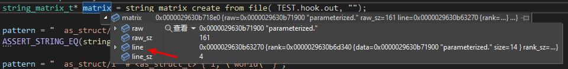
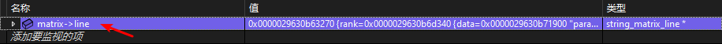
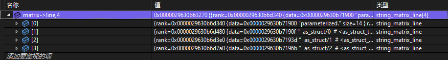

来源：[在 Visual C++ 调试器监视窗口中展开数组指针](https://learn.microsoft.com/zh-cn/troubleshoot/developer/visualstudio/cpp/debuggers/expand-pointer-debugger-watch-window)

<!-- more -->

## 背景

我们可能需要在 Visual Studio 中查看一些动态申请的数组内容：

## 解决方法

### Step 1. 添加动态数组作为监视变量

右键点击需要查看的动态数组，选择 _添加监视_ 将其加入到监视窗口。

### Step 2. 修改监视变量作为数组

在监视窗口中双击对应变量，在变量名最后输入 `,4` 并按下 _Enter_。其中数字为动态数组实际长度。

### Step 3. 展开数组查看内容

