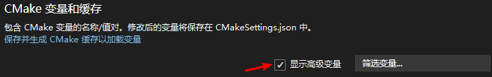
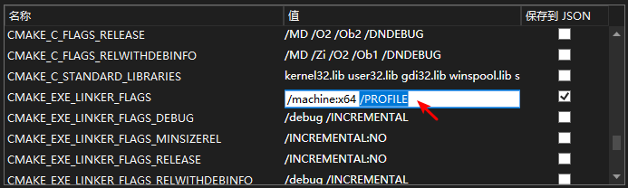
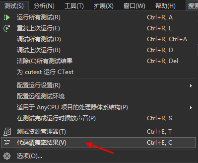

## 背景

在按照 [Use code coverage to determine how much code is being tested](https://learn.microsoft.com/en-us/visualstudio/test/using-code-coverage-to-determine-how-much-code-is-being-tested) 的方法尝试对 [cutest](https://github.com/qgymib/cutest) 进行行覆盖率测试时，发现无法获得行覆盖率结果。

<!-- more -->

## 解决方法

为了不污染项目的 `CMakeLists.txt`，所使用的解决方法必须仅限于修改 Visual Studio 的 `CMakeSettings.json` 文件。

+ Step 1. 打开 CMakeSettings.json

+ Step 2. 选中“显示高级变量”

+ Step 3. 添加 `/PROFILE` 链接选项

记得使用 `Ctrl-S` 保存 `CMakeSettings.json` 文件。

+ Step 4. 执行覆盖率测试

