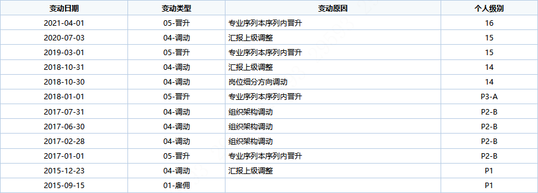

## 前景提要

1. 蜂鸟平台日益增长的覆盖范围与基线有限人力资源之间的冲突
2. 低质量需求堆叠与团队个人发展之间的冲突
3. 蜂鸟平台整体结构预计迎来变更

此文章尝试部分解决个人发展诉求与工作任务冲突的问题。

<!-- more -->

## 我是谁

+ 2014: 哈尔滨工业大学软件工程学院毕业
+ 2014/09: HTC，参与高通、展讯等厂商的modem维护
+ 2015/09: 浙江大华技术股份有限公司
    + 2015: 负责sip协议栈维护工作，应届生标准进入。P1（10）
    + 2016: 流媒体集群新技术预研、大华物联网平台预研。P2B（12）
    + 2017: 成为蜂鸟平台创建人之一，主攻低成本摄像设备领域。P2B（13）
    + 2018: 成为架构师，评选技术专家，规划落实蜂鸟平台2.0。P3A（14）
    + 2019: 摸鱼中。P3B（15）
    + 2020: 成为小组管理者，兼任架构师。P4A（16）
    + 2021: 成为团队管理者，兼任架构师；组建专家小组，负责平台整体演进规划。P4A（16）

## 大事件

### 2015 - SipStack

> 背景：
> libSipStack：大华使用开源osip库和exosip库封装而成的整合库，是一个总计数十万行代码的**客户端**接入库。

【事件】

2015年年底，移动和慧眼项目，公司将libsipstack作为服务端基础组件，导致每个服务器仅能支撑12台设备。

【困境】

1. `libSipStack`服务人群变化，强行作为服务端
2. 代码量大，3个月基本没看懂代码
3. 熟悉`libSipStack`的人离职的离职，转岗的转岗。

【动作】

1. 我的导师 [李伟7](li_wei7@dahuatech.com) 联系了前负责人，要到了以前的不完全优化方案；指出优化需要基于数据指标而不是空想

2. 引入GTest框架，建立基准性能数据

3. 引入GPerf，建立调用数据图表，分析热点数据

   

4. 探究并图表化各种数据结构的原理、性能指标，建立使用场景模型。

   

【成果】

1. 性能优化500倍。12tps提升至5000tps。
2. 了解性能优化方法论。

### 2016/06/30 - 蜂鸟v1.0 （AKA. 大华物联网平台）

> 自然语言测试框架（RobotTestFramework）：失败
>
> 流媒体集群GO化：失败
>
> 数据库存储集群：失败

1. 独立完成网络框架、文件、信号量、日志、红黑树、动态内存、内存追踪等模块，代码输出8K
2. 各模块单元测试行覆盖率为81%~86%

【困境】

无大型软件开发经验

【动作】

1. 咨询资深网络工程师（NetFramework维护者）。

【成果】

1. 积累网络编程经验。
2. 多线程+回调真tm难用。

### 2018 - 蜂鸟V2.0

+ NetMux
+ RTSP
+ RPCFramework
+ Filestream
+ 日均代码量230行

引入新技术并分析优劣：

+ 侵入式容器
+ 正则表达式

### 2019 - 蜂鸟V2.0

重构、重构、还是重构

NetMux：2次大重构。

4次重构体现出了典型的软件变更过程：

1. 瞎JB写：代码满足要求就行；
2. 第一次重构：Bug太多，代码太乱，看不下去；
3. 第二次重构：逻辑杂糅导致的添加功能困难；

恰好能运行 -> 利于修复问题 -> 利于添加需求。

## 技术专家的技能点

1. 基础知识。

   工作中多走一步：性能优化方法、网络知识、各种操作系统接口特性、各种算法特性。

2. 设计原理。

   对于代码的苛求。

## 成长速度的壁垒

为何同时期入职，每个人的成长速度都不一样？

1. 任务编排与个人能力之间的关系

   

2. 学习速度与基础积累之间的关系
